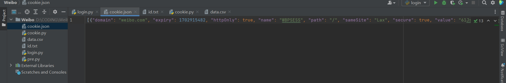
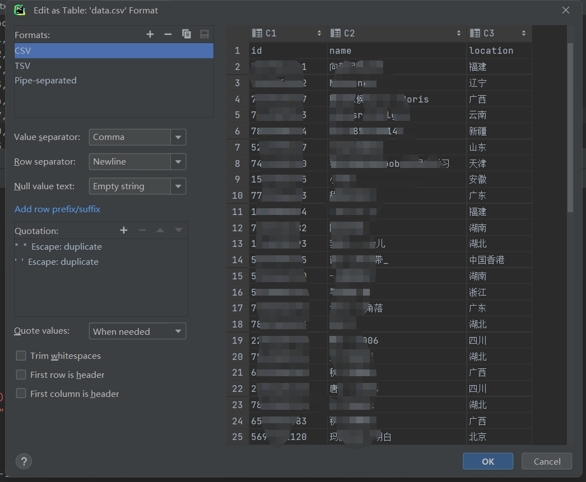
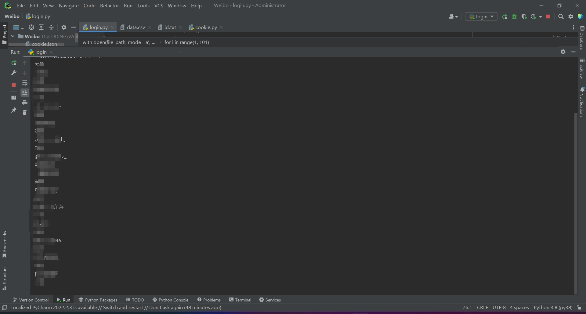

# WeiboFans_Crawl
* [introduction](#introduction)
* [thoughts](#thoughts)
* [Setup](#setup)
   * [Working configuration](#working-configuration)
* [Steps](#steps)
   * [1.cookie.json](#1cookiejson)
   * [2.information](#2information)

## Introduction

本来想通过爬取已知Crush关注的博主的粉丝获取ip地址为Crush IP（因为在国外比较好筛选）的微博粉丝群体

但是发现微博限制只能爬取最近2000个粉丝0v0...于是宣布放弃...

## Thoughts

pc端用开发者工具可以看到粉丝链接为：`https://weibo.com/ajax/friendships/friends?relate=fans&page=1&uid={uid}&type=fans&newFollowerCount=0`

- page: 这里的最大可以达到100，每一页20个粉丝，也就说明最大只能爬取2000个粉丝
- uid: 博主uid

**思路如下：**

1. selemium webdriver登录微博获取cookie
2. 之后直接利用cookie爬取，不需要再次登录
3. 根据以上链接来获取粉丝信息

**PS:** `由于我这里只想筛选ip地址，所以之后保存的信息就只有uid，昵称和ip属地，如果需要其他信息可以自行添加`

## Setup

### Working configuration

- Python 3.8
- selemium 4.9.0
- Chrome webdriver 120.0.6099.71

## Steps

### 1.cookie.json

`python pre.py`预登录微博，获取cookie.json，注意这里需要自己点击一下登录然后扫码登录（Xpath一直匹配不上，放弃），我设置的是20s等待时长。

结果如下：

### 2.information

`python login.py`

这里根据想要爬取的博主uid修改代码里面uid即可

**PS:** 这里设置了一个id.txt筛选已经爬取的用户，主要有3点考虑：

1. 经过测试，随着page的增大，每一页会有1-2个重复的粉丝账号
2. 可能爬取不完全使用者就手动停止了，为了避免重新爬取的时候重复（建议一次性爬取完整）
3. 爬取完全一轮后，博主会有新的粉丝关注，避免重复

csv结果保存如下：

这是运行的时候打印了信息方便观察：

